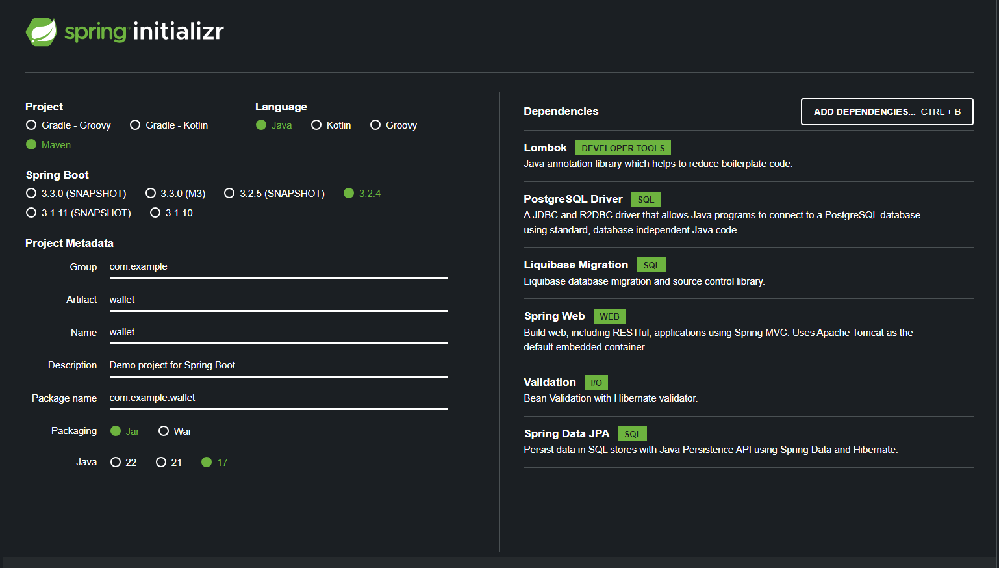

## Стек проекта

Java 17, PostgreSQL, Spring, Lombok, Spring Data JPA и Hibernate

## Мой порядок действий перед началом проекта

1. Определяемся с железом на которое будем накатывать все необходимое ПО (В моем случае это ноутбук на железе intel)
2. Устанавливаем Bash
3. Устанавливаем JDK https://www.oracle.com/java/technologies/downloads/
4. Устанавливаем Maven https://maven.apache.org/download.cgi
5. Добавляем переменные среды:
   - Для JDK создать переменную JAVA_HOME(указать каталог расположения движка), после в переменной path добавить путь бину %JAVA_HOME%\bin
   - Для Maven создать переменную M2_HOME(указать каталог расположения движка), после в переменной path добавить путь бину %M2_HOME%\bin
6. Устанавливаем Doker https://www.docker.com/get-started/ . Лично я использовал Docker Desktop installer для windows.
   - В пакете есть виртуалка для Linux, поэтому убедитесь что в настройках BIOS вашей системы включена виртуализация.
   - Так же убедитесь что у вас достаточно оперативной памяти(мой старый ноутбук во время сборки проекта в контейнера "задыхался")
7. Устанавливаем IDE и подключаем в ней все необходимые расширения для удобства работы(Я работаю с VS code).
8. Перейдем на https://start.spring.io/ и соберем проект.
   В зависимости необходимо добавить:
   *Lombok *PostgreSQL Driver *Liquibase Migration *Spring Web *Validation *Spring Data JPA
   

## Попытка запустить проект

1. Командой `mvn clean package` собираю пакет
2. Проект собирается с одной ошибкой
3. Подключаю докер(из-за слабого железа начинаются проблемы с виртуализацией, а именно кушает много оперативы)
4. Командой `docker-compose up` собираю проект в контейнер докера(И тут у меня ОС падает до полного стопа, не давая возможность нормально посмотреть даже локал хост)
5. Реализовать тесты не успел

## Условия ТЗ

1. Должны быть написаны миграции для базы данных с помощью liquibase

2. Обратите особое внимание проблемам при работе в конкурентной среде (1000 RPS по
   одному кошельку). Ни один запрос не должен быть не обработан (50Х error)

3. Предусмотрите соблюдение формата ответа для заведомо неверных запросов, когда
   кошелька не существует, не валидный json, или недостаточно средств.

4. Приложение должно запускаться в докер контейнере, база данных тоже, вся система
   должна подниматься с помощью docker-compose

5. Предусмотрите возможность настраивать различные параметры как на стороне
   приложения, так и базы данных без пересборки контейнеров.

6. Эндпоинты должны быть покрыты тестами.

7. Решенное задание залить на гитхаб, предоставить ссылку

8. Все возникающие вопросы по заданию решать самостоятельно, по своему
   усмотрению